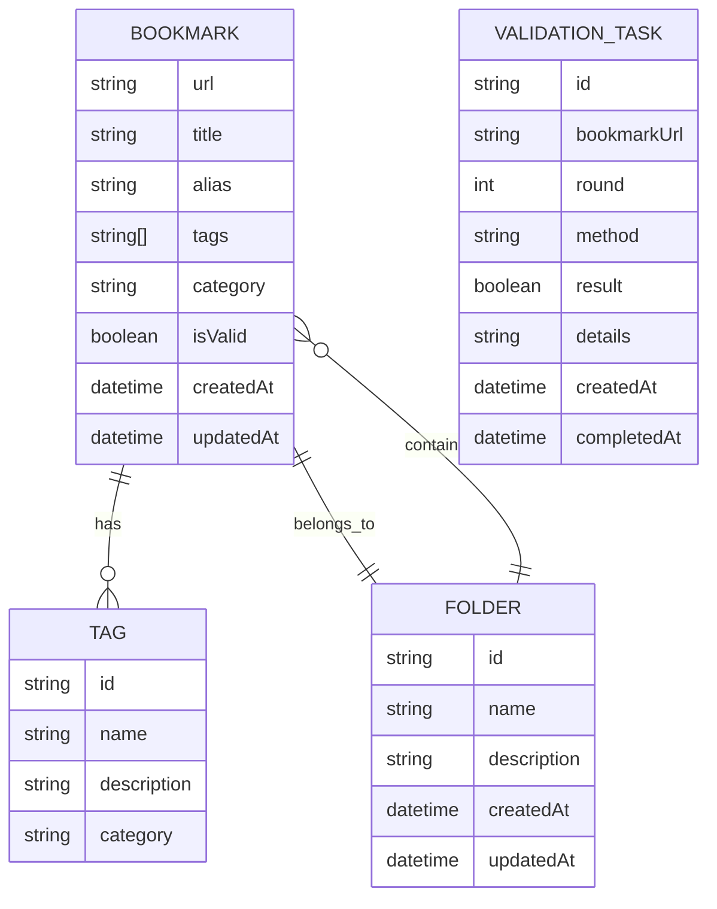

# Data Model: 智能书签管理与分类系统

## 实体关系图

## 实体详细定义

### 书签 (Bookmark)

| 字段名 | 类型 | 必填 | 描述 |
|--------|------|------|------|
| url | string | 是 | 书签的URL，唯一标识 |
| title | string | 是 | 书签的原始标题 |
| alias | string | 否 | 书签的别名 |
| tags | string[] | 是 | 书签的标签列表，每个书签3-5个标签 |
| category | string | 否 | 书签的分类 |
| isValid | boolean | 是 | 书签链接是否有效 |
| createdAt | datetime | 是 | 创建时间 |
| updatedAt | datetime | 是 | 更新时间 |

**验证规则**:
- url必须是有效的URL格式
- title不能为空
- tags数量必须在3-5个之间
- isValid默认为true

### 标签 (Tag)

| 字段名 | 类型 | 必填 | 描述 |
|--------|------|------|------|
| id | string | 是 | 标签的唯一标识 |
| name | string | 是 | 标签名称 |
| description | string | 否 | 标签描述 |
| category | string | 是 | 标签分类 |

**验证规则**:
- name不能为空
- category不能为空

### 文件夹 (Folder)

| 字段名 | 类型 | 必填 | 描述 |
|--------|------|------|------|
| id | string | 是 | 文件夹的唯一标识 |
| name | string | 是 | 文件夹名称 |
| description | string | 否 | 文件夹描述 |
| createdAt | datetime | 是 | 创建时间 |
| updatedAt | datetime | 是 | 更新时间 |

**验证规则**:
- name不能为空

### 验证任务 (ValidationTask)

| 字段名 | 类型 | 必填 | 描述 |
|--------|------|------|------|
| id | string | 是 | 验证任务的唯一标识 |
| bookmarkUrl | string | 是 | 被验证书签的URL |
| round | int | 是 | 验证轮次（1, 2, 3） |
| method | string | 是 | 验证方法 |
| result | boolean | 是 | 验证结果 |
| details | string | 否 | 验证详情 |
| createdAt | datetime | 是 | 创建时间 |
| completedAt | datetime | 否 | 完成时间 |

**验证规则**:
- round必须是1, 2, 或3
- method不能为空