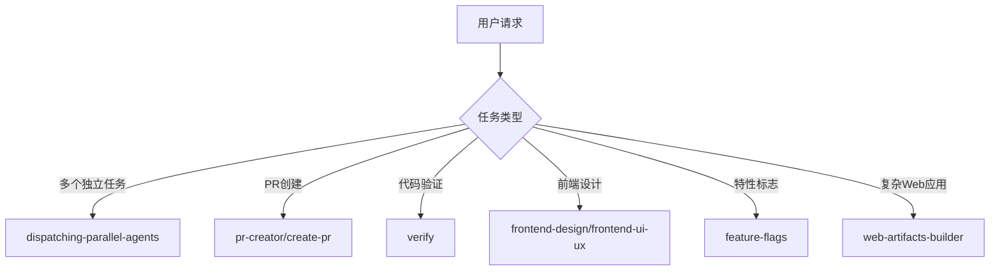

# 技能功能与使用方法文档

## 技能概述

| 技能名称 | 主要功能 | 使用场景 |
|---------|---------|--------|
| dispatching-parallel-agents | 并行任务调度器 | 同时处理多个独立任务 |
| pr-creator | GitHub PR 创建器 | 提交代码变更进行审查 |
| verify | 代码变更验证器 | 检查 React 贡献要求 |
| create-pr | GitHub PR 创建工具 | 创建符合标准的 PR |
| frontend-design | 前端界面设计专家 | 创建高质量前端界面 |
| feature-flags | 特性标志管理工具 | 处理特性标志测试和配置 |
| frontend-ui-ux | 前端 UI/UX 专家 | 设计出色的界面 |
| web-artifacts-builder | Web 工件构建器 | 创建复杂的前端界面 |

## 详细功能说明

### 1. dispatching-parallel-agents

**功能**：并行任务调度器，用于同时处理多个独立任务

**使用场景**：
- 同时执行多个不相互依赖的任务
- 并行处理多个代码分析或修改请求
- 需要同时查询多个文件或资源时

**使用方法**：
- 当面临2个或更多独立任务时，系统会自动激活此技能
- 可以明确要求并行处理多个任务

**示例**：
- "我需要同时分析三个不同文件的性能问题"
- "请并行处理这些独立的代码修改"

### 2. pr-creator

**功能**：GitHub Pull Request 创建器，确保 PR 标题符合仓库标准

**使用场景**：
- 提交代码变更进行代码审查
- 需要创建符合 CI 验证的 PR 时
- 当用户输入 /pr 或明确要求创建 PR 时

**使用方法**：
- 完成代码修改后，使用 `/pr` 命令
- 或明确要求 "创建一个 pull request"
- 系统会自动生成符合仓库标准的 PR 标题

**示例**：
- 完成代码修改后输入 `/pr`
- "请创建一个 pull request 提交这些更改"

### 3. verify

**功能**：代码变更验证器，检查 React 贡献要求

**使用场景**：
- 在提交变更前验证代码质量
- 检查所有 React 贡献要求是否满足
- 确保代码符合项目标准

**使用方法**：
- 在完成代码修改后，明确要求验证变更
- 或在提交前询问是否满足所有要求

**示例**：
- "请验证这些代码变更是否满足所有贡献要求"
- "在提交前检查是否符合所有标准"

### 4. create-pr

**功能**：GitHub Pull Request 创建工具，生成符合 PR 标题检查的 PR

**使用场景**：
- 提交代码变更进行审查
- 需要创建格式正确的 PR 时
- 当用户要求创建 pull request 时

**使用方法**：
- 完成代码修改后，明确要求创建 PR
- 系统会自动处理 PR 创建流程

**示例**：
- "请创建一个 pull request 提交这些更改"
- "我需要为这些修改创建一个 PR"

### 5. frontend-design

**功能**：前端界面设计专家，创建高质量的前端界面

**使用场景**：
- 需要设计新的前端组件或页面
- 优化现有界面的视觉效果
- 构建具有专业设计感的用户界面

**使用方法**：
- 要求设计特定的前端组件或页面
- 提供设计需求和功能描述
- 系统会生成具有高设计质量的前端代码

**示例**：
- "帮我设计一个响应式的登录页面"
- "优化这个用户仪表盘的视觉效果"

### 6. feature-flags

**功能**：特性标志管理工具，处理特性标志测试失败和配置

**使用场景**：
- 特性标志测试失败时
- 需要更新特性标志配置时
- 理解 @gate 注解时
- 调试特定渠道的测试失败时
- 向 React 添加新的特性标志时

**使用方法**：
- 当遇到特性标志相关的测试失败时
- 明确要求配置或更新特性标志
- 询问如何在 React 中实现特性标志

**示例**：
- "这个特性标志测试失败了，如何修复？"
- "如何在 React 中添加新的特性标志？"

### 7. frontend-ui-ux

**功能**：前端 UI/UX 专家，即使没有设计稿也能创建出色的界面

**使用场景**：
- 需要设计美观的前端界面但没有设计稿时
- 优化现有界面的用户体验
- 构建响应式和用户友好的界面

**使用方法**：
- 描述所需界面的功能和目标
- 提供任何现有的设计约束或偏好
- 系统会创建具有专业设计感的 UI/UX

**示例**：
- "帮我设计一个用户友好的设置页面"
- "优化这个表单的用户体验"

### 8. web-artifacts-builder

**功能**：Web 工件构建器，使用现代前端技术创建复杂的 HTML 工件

**使用场景**：
- 需要创建复杂的多组件前端界面时
- 构建需要状态管理、路由的应用时
- 使用 React、Tailwind CSS、shadcn/ui 等技术创建界面时

**使用方法**：
- 描述所需的 Web 应用或界面
- 提供功能需求和技术偏好
- 系统会生成完整的前端代码，包括必要的组件和功能

**示例**：
- "帮我创建一个带有状态管理的待办事项应用"
- "构建一个使用 shadcn/ui 的用户仪表盘"

## 最佳实践建议

### dispatching-parallel-agents
- 仅对真正独立的任务使用并行处理
- 避免并行处理相互依赖的任务

### pr-creator / create-pr
- 提交 PR 前确保代码通过所有测试
- 提供清晰的 PR 描述，说明变更的目的

### frontend-design / frontend-ui-ux
- 提供详细的设计需求和目标用户
- 明确任何品牌指南或设计约束

### web-artifacts-builder
- 详细描述应用的功能和用户流程
- 指定所需的技术栈和库

### feature-flags
- 为重要功能使用特性标志进行渐进式发布
- 定期清理不再使用的特性标志

## 技能使用流程图

## 常见使用场景

| 场景 | 推荐技能 | 使用方法 |
|------|---------|--------|
| 同时处理多个代码文件 | dispatching-parallel-agents | 明确要求并行处理多个文件 |
| 提交代码变更审查 | pr-creator/create-pr | 使用 /pr 命令或明确要求 |
| 验证代码质量 | verify | 明确要求验证代码变更 |
| 设计新界面 | frontend-design/frontend-ui-ux | 描述设计需求 |
| 构建复杂Web应用 | web-artifacts-builder | 详细描述应用功能 |
| 管理特性发布 | feature-flags | 询问特性标志相关问题 |