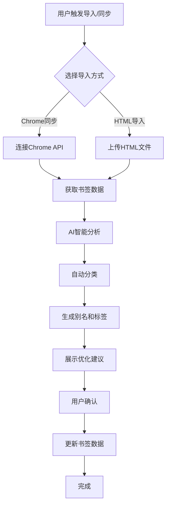
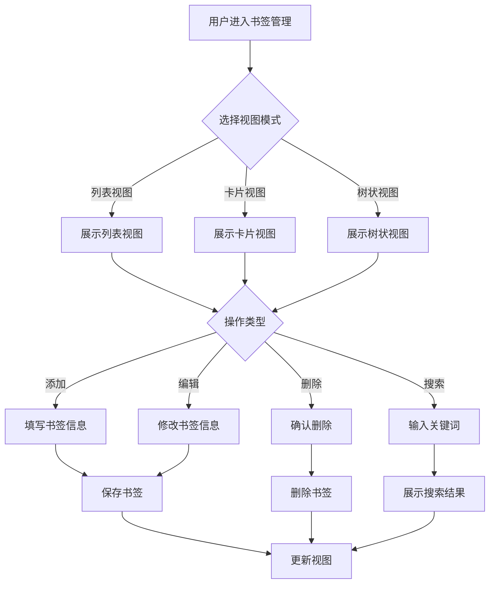
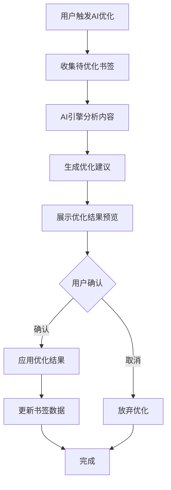
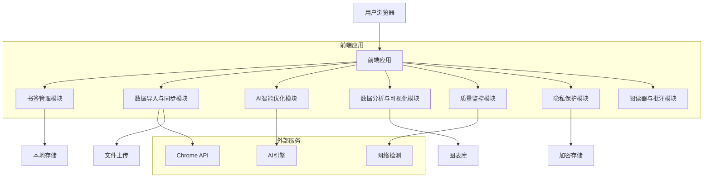
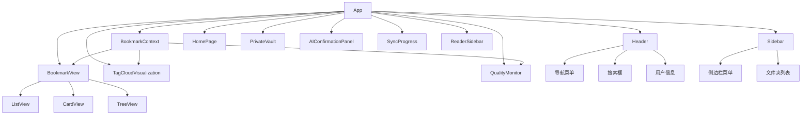

# 项目概述文档

## 目录

1. [项目基本信息](#1-项目基本信息)
2. [核心功能模块](#2-核心功能模块)
3. [主要业务流程逻辑](#3-主要业务流程逻辑)
4. [技术架构设计](#4-技术架构设计)
5. [关键模块组成结构](#5-关键模块组成结构)
6. [项目整体应用场景与价值定位](#6-项目整体应用场景与价值定位)
7. [总结](#7-总结)

## 1. 项目基本信息

| 项目属性 | 详细信息 |
|---------|---------|
| 项目名称 | Data Collection & AI Processing |
| 项目类型 | 智能书签管理系统 |
| 技术栈 | React 18.3.1 + TypeScript + Vite + Tailwind CSS + Radix UI |
| 设计来源 | Figma设计稿（https://www.figma.com/design/oo3iY0uhSn8I0ii51uUYSX/Data-Collection---AI-Processing） |
| 项目定位 | AI驱动的智能书签管理系统，帮助用户整理、分类、优化收藏，打造个人知识图谱 |

## 2. 核心功能模块

### 2.1 书签管理模块

**功能描述**：提供完整的书签管理功能，支持多种视图模式和搜索功能。

**子功能**：
- 书签的添加、编辑、删除
- 三种视图模式：列表视图、卡片视图、树状视图
- 全文搜索（支持标题、URL、标签、批注）
- 书签分类与标签管理

### 2.2 数据导入与同步模块

**功能描述**：支持从多种来源导入和同步书签数据。

**子功能**：
- Chrome浏览器实时同步
- HTML文件批量导入
- 增量更新支持
- 冲突智能处理

### 2.3 AI智能优化模块

**功能描述**：利用AI技术对书签进行智能分析和优化。

**子功能**：
- 自动分类
- 生成别名
- 提取标签
- 内容智能分析

### 2.4 数据分析与可视化模块

**功能描述**：提供书签数据的可视化分析功能。

**子功能**：
- 标签云可视化
- 分类统计
- 使用趋势分析
- 热力图分析

### 2.5 质量监控模块

**功能描述**：自动检测书签质量，提供优化建议。

**子功能**：
- 重复链接检测
- 失效书签巡检
- 健康度评分
- 定期报告

### 2.6 隐私保护模块

**功能描述**：提供独立的隐私空间，保护敏感书签。

**子功能**：
- 独立加密空间
- 密码保护
- 隐私标签
- 安全备份

### 2.7 阅读器与批注模块

**功能描述**：支持在侧边栏阅读书签内容并添加批注。

**子功能**：
- 侧边栏阅读模式
- 文本高亮
- 添加批注
- 导出笔记

## 3. 主要业务流程逻辑

### 3.1 书签导入与优化流程



### 3.2 书签管理流程



### 3.3 AI优化流程



## 4. 技术架构设计

### 4.1 前端架构

| 技术/框架 | 版本 | 用途 |
|----------|------|------|
| React | 18.3.1 | 前端框架 |
| TypeScript | - | 类型系统 |
| Vite | 6.3.5 | 构建工具 |
| Tailwind CSS | 4.1.12 | CSS框架 |
| Radix UI | 1.x | UI组件库 |
| Lucide React | 0.487.0 | 图标库 |
| Motion | 12.23.24 | 动画库 |
| React Hook Form | 7.55.0 | 表单处理 |
| Recharts | 2.15.2 | 图表库 |

### 4.2 后端技术栈（规划中）

| 技术/框架 | 用途 |
|----------|------|
| Node.js | 后端运行时 |
| Express | Web框架 |
| MongoDB | 数据库 |
| Mongoose | ODM |
| JWT | 认证 |
| Socket.IO | 实时通信 |

### 4.3 数据库设计（规划中）

| 集合名称 | 用途 |
|----------|------|
| users | 用户信息 |
| bookmarks | 书签数据 |
| folders | 文件夹数据 |
| annotations | 批注数据 |
| activities | 活动记录 |

### 4.4 系统架构图



## 5. 关键模块组成结构

### 5.1 项目目录结构

```
├── src/
│   ├── app/
│   │   ├── components/          # 组件目录
│   │   │   ├── ui/             # UI组件（Radix UI封装）
│   │   │   ├── figma/          # Figma相关组件
│   │   │   ├── views/          # 视图组件（列表、卡片、树状）
│   │   │   ├── AIConfirmationPanel.tsx   # AI优化面板
│   │   │   ├── BookmarkView.tsx          # 书签视图主组件
│   │   │   ├── Header.tsx               # 头部导航组件
│   │   │   ├── HomePage.tsx             # 首页组件
│   │   │   ├── PrivateVault.tsx         # 隐私空间组件
│   │   │   ├── QualityMonitor.tsx       # 质量监控组件
│   │   │   ├── ReaderSidebar.tsx        # 阅读器侧边栏组件
│   │   │   ├── Sidebar.tsx              # 侧边栏导航组件
│   │   │   ├── SyncProgress.tsx         # 同步进度组件
│   │   │   └── TagCloudVisualization.tsx # 标签云可视化组件
│   │   ├── contexts/            # 上下文管理
│   │   │   └── BookmarkContext.tsx      # 书签数据上下文
│   │   └── App.tsx              # 主应用组件
│   ├── styles/                  # 样式文件
│   │   ├── fonts.css           # 字体样式
│   │   ├── index.css           # 全局样式
│   │   ├── tailwind.css        # Tailwind CSS入口
│   │   └── theme.css           # 主题样式
│   └── main.tsx                 # 应用入口文件
├── index.html                   # HTML模板
├── package.json                 # 项目配置与依赖
├── postcss.config.mjs           # PostCSS配置
└── vite.config.ts               # Vite配置
```

### 5.2 核心组件关系图



## 6. 项目整体应用场景与价值定位

### 6.1 应用场景

1. **个人知识管理**
   - 管理大量书签，构建个人知识体系
   - 快速查找和访问所需信息
   - 分析个人兴趣和学习趋势

2. **工作效率提升**
   - 整理工作相关资源
   - 共享和协作管理书签
   - 定期清理失效资源

3. **学习资料管理**
   - 分类存储学习资料
   - 添加批注和笔记
   - 保护敏感学习内容

4. **研究资料收集**
   - 收集和整理研究资料
   - 分析研究领域趋势
   - 生成研究报告

### 6.2 价值定位

| 价值维度 | 具体体现 |
|---------|---------|
| 智能化 | AI驱动的自动分类和优化，减少手动操作 |
| 高效性 | 强大的搜索和过滤功能，提高信息获取效率 |
| 可靠性 | 质量监控确保书签有效性 |
| 安全性 | 隐私保护机制保障敏感信息安全 |
| 易用性 | 直观的界面设计，流畅的用户体验 |
| 可扩展性 | 模块化设计，支持未来功能扩展 |

## 7. 总结

Data Collection & AI Processing是一款功能全面、设计精良的智能书签管理系统，它将传统的书签管理与AI技术相结合，为用户提供了高效、智能、安全的知识管理解决方案。

项目采用现代化的技术栈，包括React 18、TypeScript、Vite和Tailwind CSS，具有良好的扩展性和可维护性。核心功能涵盖了书签管理、数据导入与同步、AI智能优化、数据分析与可视化、质量监控、隐私保护以及阅读器与批注等多个方面。

该项目的应用场景广泛，包括个人知识管理、工作效率提升、学习资料管理和研究资料收集等。其核心价值在于通过智能化手段提高用户的信息管理效率，帮助用户构建个人知识图谱，实现信息的高效获取和利用。

未来，该项目可以进一步扩展后端功能，支持多设备同步和云存储，引入更先进的AI模型，提供更智能的分析和建议，开发浏览器扩展和移动端应用，实现全平台覆盖。